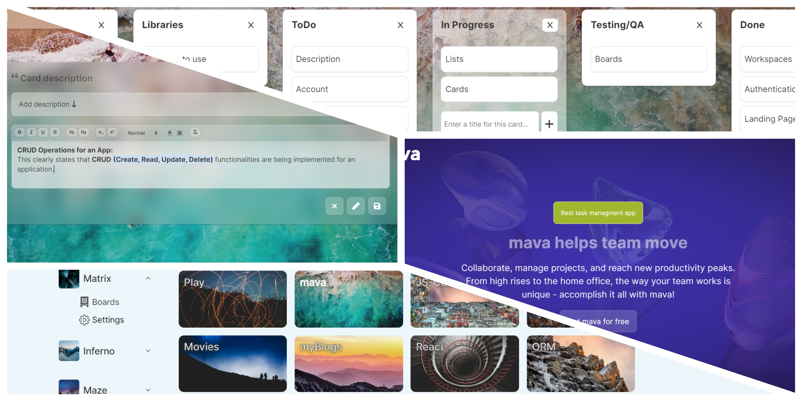

<h1><a id='top'>mava app</a></h1>

**mava** is a Trello clone designed to streamline task management and collaboration within teams. It provides a user-friendly interface for creating boards, lists, and cards to organize and prioritize tasks efficiently.

## Features

- **Create Boards:** Represent different projects or categories.
- **Organize Lists:** Efficiently manage tasks within boards using lists.
- **Break Down Tasks:** Create individual cards for each task with unique details and comments.

## Dependencies

- **reduxjs/toolkit**
- **crypto-js**
- **firebase**
- **react-beautiful-dnd**
- **react-quill**
- **react-router-dom**
- **unsplash-js**

## To run this application, you'll need the following software installed on your system:

**Node.js and npm:** These are essential for managing JavaScript dependencies in the project. You can download and install them from the official Node.js website: https://nodejs.org/

## To run this application follow these steps

1. **Clone this repository:**
   git clone [https://github.com/manevardazaryan1/mava]

2. **Navigate to the project directory:**
    Navigate to the project folder(cd [project folder name])

3. **Install dependencies:**
    npm install

4. **Running the Application**
    npm start

This will typically launch the application in your default web browser, usually at http://localhost:3000 (the port may vary). You can then interact with the app and see its functionality in action.

[Tap to Top ⬆](#top)